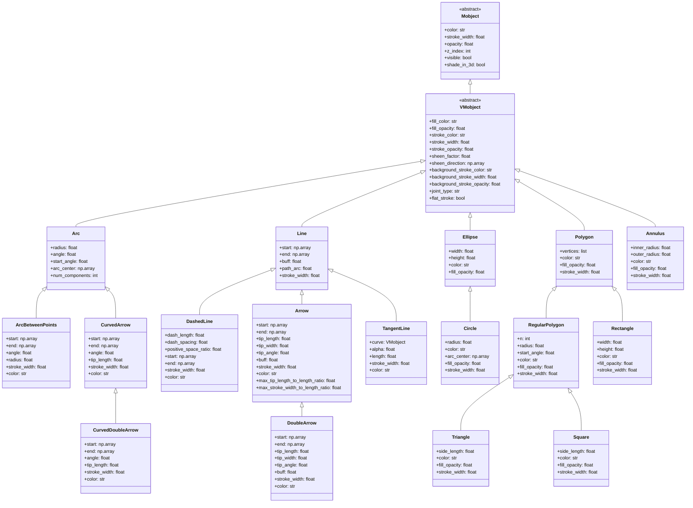

<div align="center"><h1>Manim学习笔记</h1></div>

> 注意:本笔记默认读者已经学会Python基础和Python中类的概念.

### 第一节 安装

我这里介绍我的安装方式,首先确保自己电脑已经按照了Python以及Python的Pip.如果确认无误,我们就在命令行中输入:

```bash
pip install manim
```

这个可能要花一点时间,请耐心等待,

下载好后可以使用下列命令来确认:

```bash
manim --version
```

如果不行可能是全局变量的问题,如果你不想麻烦可以使用:

```bash
python -m manim --version
```

返回对应的版本号就行,我这里返回的为:

```bash
Manim Community v0.19.0
```

请注意之后的版本我默认使用`python -m manim`的形式,如果你的第一个方法可行,就把前面的`python -m`去掉就行.

### 第二节 基本结构

我们给出一个简单的实现方式:

```python
from manim import *

class SimpleExample(Scene):

    def construct(self):
        text = Text("Hello, Manim!")
        self.play(Write(text))
        self.wait(2)
        self.play(FadeOut(text))
```

这就是一个简单的manim实例,实现的就是显示`Hello.Manim!`的动画效果.这里你必须包含:

1. manim库的引用:`from manim import *`
2. 程序接口类:由用户自定义名称
3. 动画构建函数:`def construct(self)`

确保这三个都用,你的程序就可以运行,运行可以在命令行中输入:

```bash
python -m manim ./程序路径 程序接口类名
# 在实例文件中就是
python -m manim -pql .\Src\simple_example.py SimpleExample
```

等等?`-pql`是什么?其实这是三个的组合:

- `-p`:渲染完成后自动打开视频文件
- `-q`:用来指定渲染的质量等级,后面需要跟一个字母来指定质量等级
- `-l,-m,-h,-k`:这是渲染的四个质量等级:这四个分别是:低质量,中等质量,高质量和4k质量

这三个的组合决定我们视频输出的质量,在开发阶段用`-pql`就行了.

### 第三节 图形基础

好了,我们纵欲要开始学习制作一个动画了!在学习动画效果之前,我们先来让我们需要的物品展示在屏幕上吧!不过虽然不学习动画效果当我们还是要先了解一下一些可能用到的函数:

```python
self.play()
self.wait()
write()
create()
FadeOut()
FadeIn()
```

这些就是我们在正式学习动画钱需要了解的函数,我们来一个一个介绍:

首先是`self.play()`这是用来显示动画效果的,如果你想让你的视频动起来,就可以用这个函数来加载动画,`self.wait()`是延迟或者是暂停函数,如果不加任何参数就是默认等待1s,参数就是对应的延迟秒数.`create`和`wrie`是将对应的图形或者叫做object在屏幕上展示.而`FadeOut`是淡出,也就是图形或者object在屏幕上逐渐消失.`FadeIn`是淡入.

Manim支持几何图形,文本和坐标系.我们接下来一个一个介绍

#### 3.1 几何图形

##### 3.1.1 圆形

> 作为学习的第一个图形,我们会介绍的详细一点,但是还是有许多用不到的参数(至少做一些简单的用不到),就不多介绍,后续如果没有强调就默认和之前介绍的一样

我们要学会创建一个圆形,我们称为Object对象(Manim有VObject和MObject等),可以用下列语句:

```python
circle_obejct = Circle()
```

Circle并不是一个初始类,而是一个继承了Arc的子类,所以我们做一个简单的分类:

```python
Circle(
	radius = 1,#半径长度
    color = BLUE,#圆形边框颜色
    
    arc_center = UP,#圆形中心的位置
    num_components = 9,#由多少段三次贝塞尔曲线近似构成,影响平滑度与渲染性能,圆形不是很明显
    
    fill_opacity = 0.5,#中心填充的透明度
    fill_color = RED,#中心填充的颜色,若无默认和color边框颜色一致
    
    stroke_color = RED,#描边/边框颜色
    stroke_opacity = 0.5,#描边/边框填充的透明度(1是完全不透明)
    stroke_width=1,#描边/边框宽度
    
    background_stroke_color = RED,#背景描边的颜色
    background_stroke_opacity = 0.5,#背景描边的透明度
    background_stroke_width=1,#背景描边的
    
    sheen_factor = 0.5, #光泽效果程度
    sheen_direction=UP+LEFT#光泽方向
)
```

下面是圆形的展示效果:
<div align="center"></div>

##### 3.1.2 圆弧

在这一节开始前,我认为有必要介绍一下Manim的全局坐标系Manim 使用标准的**三维笛卡尔坐标系**：**原点 (ORIGIN)**: `(0, 0, 0)`位于屏幕正中心,**X轴**: 水平方向，**向右**为正方向,**Y轴**: 垂直方向，**向上**为正方向,**Z轴**: 深度方向，**指向屏幕外**为正方向.Manim 采用了一个非常聪明的尺度系统：**屏幕高度**被固定为 **8个单位****,**屏幕宽度**根据宽高比自动计算：顶部边缘: Y = +4,底部边缘: Y = -4,右侧边缘: X ≈ +7.111 (16:9时),左侧边缘: X ≈ -7.111 (16:9时)

虽然现在可能用不到,但还是要介绍,不然大家可能不知道半径为1的圆形到底有多大.

现在我们就可以介绍一下Arc圆弧了,他是圆形的父类,所以圆形有的半径圆形有的东西他也有,但是它额外引出了start_angle和angle.

```python
Arc(
    radius=2.0, #半径
    start_angle=PI/2,#起始角度
    angle=TAU/2#整个圆弧的角度
)
```

这里出现了PI和TAU,PI大家都知道是圆周率,在角度中就对应了180度,而TAU代表了一个整圆,所以我们有$TAU = 2PI$

<div align="center"></div>

处理这种通过定位圆心和半径角度来确定圆弧的方法,Manim还支持使用ArcBetweenPointsShow来通过两点确定圆弧.他支持的参数如下:

```python
ArcBetweenPointsShow(
	start=LEFT,
    end=RIGHT,
    angle=3*PI/4, 
    radius=-4
)
```

这里需要说明的时,start和end是永远有效的,但是angles和radius只有一个有效,(目前认为radius优先级比angle高).当radius小于0,就是反向绘制.

<div align="center"></div>

##### 3.1.3 矩形

学到这里我们已经可以直接看API了,这是整理出来一些特有的参数:

```python
retangle_object = Rectangle(
	width=2, 
    height=3, 
    color=BLUE, 
    
    fill_opacity=0.5, 
    fill_color=BLUE_E, 
    
    grid_xstep=0.5, # 添加垂直网格线
    grid_ystep=0.5	# 添加水平网格线
)
```

下面是演示:

<div align="center"></div>

##### 3.1.4 正方形

有意思的是正方形是Retangle的子类,它强制定义width = height = side_length,所以,它的有效参数我们可以认为只有side_length,剩下都是继承得来.

```python
Square(side_length= 1.2)
```

<div align="center"></div>

##### 3.1.5 三角形

虽然有必要介绍一下三角形如何生成,但manim的三角形实在是能力太差,最好的三角形生成还是要依靠多边形生成,所以单独属于Triangle的参数不多,下载展示的基本上都是重复的,改变大小要依靠scale,这个我们会在动画/定位中结束.

```python
triangle = Triangle(
    color=BLUE, 		# 边框颜色
    fill_color=YELLOW, 	# 填充颜色
    fill_opacity=0.5, 	# 填充透明度
    stroke_width=10		# 边框宽度
)
```

<div align="center"></div>

##### 3.1.6 直线

直线是和线有类型的基础,但实际上对于我们来说,常用的也就这些

```python
Line(
    start=(2,2,0),	# 起点的坐标
    end=(-2,-2,0),	# 终点的坐标
    buff=0,			# 直线两端距离设定坐标的距离
    path_arc=PI/2,	# 让直线变成圆弧的“弧度”值,0就是真的直线,正数 → 逆时针弯；负数 → 顺时针弯。
    color=BLUE		# 直线颜色
)
```

<div align="center"></div>

##### 3.1.7 单向直线箭头

`stroke_width`决定了箭杆有多粗实际粗细还会被`max_stroke_width_to_length_ratio`再“压”一次.`buff`决定了箭头两端留白距离,值越大，可见箭身越短；太大会让箭消失,`max_tip_length_to_length_ratio`决定了箭头“最大允许长度”与“箭身长度”的比例上限,把值调大，小箭头也能长出“大尖”；调小，长箭头也会被强制短尖.`max_stroke_width_to_length_ratio`决定了箭杆“最大允许粗细”与“箭身长度”的比例上限,想“无视比例”固定粗细：把该值设成很大，同时直接给`stroke_width`=你想要的像素,`tip_shape`可以选择箭头尖角的“形状类”

|          类名          |   效果   |
| :--------------------: | :------: |
|   `ArrowTriangleTip`   | 空心三角 |
|    `ArrowSquareTip`    | 空心方块 |
| `ArrowSquareFilledTip` | 实心方块 |
|    `ArrowCircleTip`    |  空心圆  |
| `ArrowCircleFilledTip` |  实心圆  |

```python
Arrow(
    stroke_width=3,
    buff=0.5,
    max_tip_length_to_length_ratio=0.5,
    max_stroke_width_to_length_ratio=2,
    tip_shape=ArrowTriangleTip
)
```

<div align="center"></div>

##### 3.1.8 双向箭头

其实,你看一下源码就会发现,这个完全没自己的参数,全是继承Arrow,不过还是被我发现了两个,`tip_shape_end`和`tip_shape_start`.前一个指定了末尾箭头的形状,后一个指定了开始箭头的性质(和Arrow的`tip_shape`一个道理)

```python
DoubleArrow(
    stroke_width=3,
     buff=0.5,
    max_tip_length_to_length_ratio=0.5,
    max_stroke_width_to_length_ratio=2,
    tip_shape_end=ArrowSquareTip,
    tip_shape_start = ArrowCircleTip
)
```

<div align="center"></div>

##### 3.1.9 圆弧箭头

圆弧箭头有两个,一个单向,一个是双向,在这里先介绍一下单向圆弧箭头.

他其实是继承于ArcBetweenPoints的,而且是箭头,也支持了tip_shape.

```python
CurvedArrow(
    start_point=LEFT*3, 
    end_point=RIGHT*3,
    angle=PI/4,
    radius=4,
    tip_shape=ArrowSquareTip
)
```

<div align="center"></div>

CurvedDoubleArrow继承于CurvedArrow,除了改变量tip_shape其他都一样

```python
CurvedDoubleArrow(
    start_point=LEFT*2, 
    end_point=RIGHT*2, 
    angle=PI/4,
    radius=4,
    tip_shape_start=ArrowCircleTip,
    tip_shape_end=ArrowSquareTip
)
```

<div align="center"></div>

##### 3.1.10 圆环

圆环对应的类是Annulus,它主要有以下参数:

```python
Annulus(
    outer_radius=1.5,		# 外圆几何半径
    inner_radius=0.5,  		# 内圆的几何半径 outer_radius 必须 ≥ inner_radius
    fill_opacity=0.5,  		# 填充颜色的不透明度
    color=BLUE, 			# 同时管“填充色”和“描边色”
    stroke_width=0.5,		# 外圈 + 内圈那两道“边线”的粗细
    mark_paths_closed=True,	# 是否把内外两条圆环路径标记为“闭合”,它主要影响之后的算法
)
```

<div align="center"></div>

##### 3.1.11 多边形

多边形主要分为普通的多边形(Polygon)和正多边形(RegularPolygon),主要参数为:

```python
Polygon(
	*[  # 九边形
		[0, 0, 0],
        [1, 0.1, 0],
        [1.7, 0.5, 0],
        [2, 1.1, 0],
        [1.8, 1.7, 0],
        [1.2, 2, 0],
        [0.5, 1.8, 0],
        [0, 1.2, 0],
        [-0.4, 0.6, 0]
	]#指定多边形各个点的位置(一定要带者*)
)

RegularPolygon(
	n=8 #指定正多边形的变数
)
```

<div align="center"></div>

##### 3.1.12 椭圆

> 他居然是继承于Circle!

椭圆是继承于Circle的,所以它的很多参数都是和Circle类似的,它的核心参数只有两个width和height,分别是横轴的长度和竖轴的长度.

```python
Ellipse(
    width=4, 
    height=2
)
```

<div align="center"></div>

##### 3.1.13 虚线

**`dash_length`**：这个参数直接设置了你看到的每一小段"横线"有多长。默认为DEFAULT_DASH_LENGTH = 0.05.**`dashed_ratio`**：这个参数控制的是一个**周期内实线部分的占比**。**比值越大**（接近1），实线部分占比越大，间隙越小，虚线看起来越**密集**。**比值越小**（接近0），实线部分占比越小，间隙越大，虚线看起来越**稀疏**。

其余参数基础直线

```python
DashedLine(
	dash_length = 0.1,
    dashed_ratio = 0.6
)
```

<div align="center"></div>

#### 3.1.14 总结




#### 3.2 文本与公式


#### 3.3 其他


### 第四节 定位和移动


### 第五节 动画与变化


### 第六节 布局与排列


### 第七节 数学动画


### 第八节 高级动画

