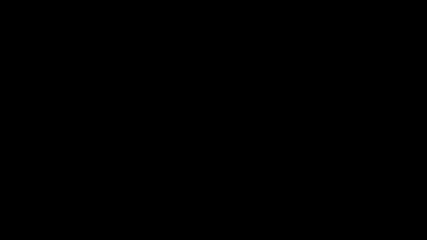

<div align="center"><h1>Manim学习笔记</h1></div>

> 注意:本笔记默认读者已经学会Python基础和Python中类的概念.

### 第一节 安装

我这里介绍我的安装方式,首先确保自己电脑已经按照了Python以及Python的Pip.如果确认无误,我们就在命令行中输入:

```bash
pip install manim
```

这个可能要花一点时间,请耐心等待,

下载好后可以使用下列命令来确认:

```bash
manim --version
```

如果不行可能是全局变量的问题,如果你不想麻烦可以使用:

```bash
python -m manim --version
```

返回对应的版本号就行,我这里返回的为:

```bash
Manim Community v0.19.0
```

请注意之后的版本我默认使用`python -m manim`的形式,如果你的第一个方法可行,就把前面的`python -m`去掉就行.

### 第二节 基本结构

我们给出一个简单的实现方式:

```python
from manim import *

class SimpleExample(Scene):

    def construct(self):
        text = Text("Hello, Manim!")
        self.play(Write(text))
        self.wait(2)
        self.play(FadeOut(text))
```

这就是一个简单的manim实例,实现的就是显示`Hello.Manim!`的动画效果.这里你必须包含:

1. manim库的引用:`from manim import *`
2. 程序接口类:由用户自定义名称
3. 动画构建函数:`def construct(self)`

确保这三个都用,你的程序就可以运行,运行可以在命令行中输入:

```bash
python -m manim ./程序路径 程序接口类名
# 在实例文件中就是
python -m manim -pql .\Src\simple_example.py SimpleExample
```

等等?`-pql`是什么?其实这是三个的组合:

- `-p`:渲染完成后自动打开视频文件
- `-q`:用来指定渲染的质量等级,后面需要跟一个字母来指定质量等级
- `-l,-m,-h,-k`:这是渲染的四个质量等级:这四个分别是:低质量,中等质量,高质量和4k质量

这三个的组合决定我们视频输出的质量,在开发阶段用`-pql`就行了.

### 第三节 图形基础

好了,我们纵欲要开始学习制作一个动画了!在学习动画效果之前,我们先来让我们需要的物品展示在屏幕上吧!不过虽然不学习动画效果当我们还是要先了解一下一些可能用到的函数:

```python
self.play()
self.wait()
write()
FadeOut()
FadeIn()
```

这些就是我们在正式学习动画钱需要了解的函数,我们来一个一个介绍:

首先是`self.play()`这是用来显示动画效果的,如果你想让你的视频动起来,就可以用这个函数来加载动画,`self.wait()`是延迟或者是暂停函数,如果不加任何参数就是默认等待1s,参数就是对应的延迟秒数.`wrie`是将对应的图形或者叫做object在屏幕上展示.而`FadeOut`是淡出,也就是图形或者object在屏幕上逐渐消失.`FadeIn`是淡入.

Manim支持几何图形,文本和坐标系.我们接下来一个一个介绍

#### 3.1 几何图形

##### 3.1.1 圆形

> 作为学习的第一个图形,我们会介绍的详细一点,但是还是有许多用不到的参数(至少做一些简单的用不到),就不多介绍,后续如果没有强调就默认和之前介绍的一样

我们要学会创建一个圆形,我们称为Object对象(Manim有VObject和MObject等),可以用下列语句:

```python
circle_obejct = Circle()
```

Circle并不是一个初始类,而是一个继承了Arc的子类,所以我们做一个简单的分类:

```python
Circle(
	radius = 1,#半径长度
    color = BLUE,#圆形边框颜色
    
    arc_center = UP,#圆形中心的位置
    num_components = 9,#由多少段三次贝塞尔曲线近似构成,影响平滑度与渲染性能,圆形不是很明显
    
    fill_opacity = 0.5,#中心填充的透明度
    fill_color = RED,#中心填充的颜色,若无默认和color边框颜色一致
    
    stroke_color = RED,#描边/边框颜色
    stroke_opacity = 0.5,#描边/边框填充的透明度(1是完全不透明)
    stroke_width=1,#描边/边框宽度
    
    background_stroke_color = RED,#背景描边的颜色
    background_stroke_opacity = 0.5,#背景描边的透明度
    background_stroke_width=1,#背景描边的
    
    sheen_factor = 0.5, #光泽效果程度
    sheen_direction=UP+LEFT#光泽方向
)
```

下面是圆形的展示效果:
<div align="center"></div>

##### 3.1.2 圆弧


##### 3.1.3 矩形

学到这里我们已经可以直接看API了,这是整理出来一些特有的参数:

```python
retangle_object = Rectangle(
	width=2, 
    height=3, 
    color=BLUE, 
    
    fill_opacity=0.5, 
    fill_color=BLUE_E, 
    
    grid_xstep=0.5, # 添加垂直网格线
    grid_ystep=0.5	# 添加水平网格线
)
```

下面是演示:

<div align="center"></div>

##### 3.1.4 正方形


##### 3.1.5 三角形

虽然有必要介绍一下三角形如何生成,但manim的三角形实在是能力太差,最好的三角形生成还是要依靠多边形生成,所以单独属于Triangle的参数不多,下载展示的基本上都是重复的,改变大小要依靠scale,这个我们会在动画/定位中结束.

```python
triangle = Triangle(
    color=BLUE, 		# 边框颜色
    fill_color=YELLOW, 	# 填充颜色
    fill_opacity=0.5, 	# 填充透明度
    stroke_width=10		# 边框宽度
)
```

<div align="center"></div>

##### 3.1.6 直线


##### 3.1.7 单向直线箭头


##### 3.1.8 双向箭头


##### 3.1.9 圆弧箭头


##### 3.1.10 圆环


##### 3.1.11 多边形


##### 3.1.12 椭圆


##### 3.1.13 虚线


#### 3.2 文本与公式


#### 3.3 其他


### 第四节 定位和移动


### 第五节 动画与变化


### 第六节 布局与排列


### 第七节 数学动画


### 第八节 高级动画

